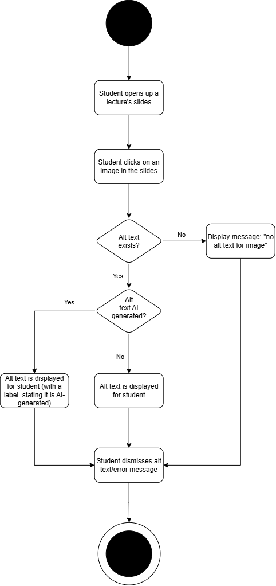

# Specification Phase Exercise

A little exercise to get started with the specification phase of the software development lifecycle. In this exercise, your team specifies a set of improvements and new features for [The Slide Machine](https://theslidemachine.com) — see the [instructions](instructions.md) for detail, and the [background](background.md) for an introduction to the software product you are tasked with extending.

## Team members

Daran: dyt2010@nyu.edu | https://github.com/slvrtngd  

Tristan: ttm2041@nyu.edu | https://github.com/Trisolis

Levi: lg4493@nyu.edu | https://github.com/9021007

Robert: rf2789@nyu.edu | https://github.com/rfang1224 

Amitav: an4245@nyu.edu | https://github.com/AmitavNarayan

## Review of the Current Application
Our findings are listed below:  

1 - The app’s decisions about when to create or update a slide are inconsistent; for example, sometimes continued speech produced no new slide, even after a pause. As other examples, repeating a correction after a mistake created a new slide rather than fixing the current one, and speaking for a long stretch only resulted in one slide (weakness).  

2 - The dashboard/display for the API and usage is easily accessible, very clear, and provides an ample amount of detail. The instructor can easily tell whether he/she is running close to any limits on the app (strength).  

3 - The app supports English, French, Spanish, Russian, and Chinese, but other languages like German or Arabic are missing (gap).  

4  - Voice commands have to start their own phrase; for example, saying “Okay, Slide Machine, next” does not work because of the “Okay” and is treated as lecture speech. Having to start with “Slide Machine” every time is difficult and confusing (weakness).  

5 - There is no way to test or adjust the microphone (run a sample sentence, for example) prior to starting the lecture (gap).  

6 - Oftentimes during a live lecture, it’s unclear what the app has done or heard. In particular, after a few seconds of speech the caption text disappeared with no visible change to the deck and the user couldn’t tell which speech would ultimately become slide content. The caption line did not appear for long enough to really help the user (weakness).  

7 - The basic formatting control of the slides is limited. There is no clear way to change font size, move elements around a slide, or manually structure content as tables. The spoken transcript and the slide’s content have to be edited separately (gap).  

8 - When the app captures speech correctly, the content is well-done; the app can accurately display math notation, add helpful definitions, and knows not to duplicate slides when a topic is mentioned again (strength).  

9 - There is no way to search or sort your own lectures and projects. Lectures are always listed newest first (no option for alphabetical order, oldest first, etc.) and require manual rearranging, and you can search through public lectures using Discover, but not your own work specifically (gap).  

10 - The whiteboard tool works well; the instructor has options to immediately draw on the board with a pen, highlighter or an eraser, and slide generation will pause automatically, or he/she can easily create a new whiteboard slide to keep drawings separate. The tool greatly enhances the instructor’s ability to clarify and visualize concepts (strength). 

## Prior Art & Originality
Our Statement:  

We examined the Future Work and Open Questions sections of the Software Design Document, the delivery roadmap, and the repository’s open and closed issues and pull requests. Currently, the Slide Machine does not support video as content, but it includes the option to drag-and-drop slides in a list, and sets alt text for images to one of three default options: caption, slide title, or "Slide Image." Our proposal builds on this work by adding more extensive options for re-ordering and viewing slides and for editing alt text for slide images, and by establishing video as a new kind of content. Importantly, whilst the Software Design Document rules out general-purpose design and free-form graphic design, it emphasizes editing and templating content (potentially with AI’s help), and our proposal is a novel improvement in this regard. 

## Stakeholders

### Instructors

**Instructor A**
- Goals: Wants slides that are easy to read and uncluttered; wants proper mathematical notation/symbols for math content; wants slides clear and descriptive enough for students to follow the lecture from reading alone; wants quizzes that challenge students and promote critical thinking.
- Frustrations: The app didn't include graphs (e.g. binomial distributions) despite math-heavy content; generated quiz answer choices were too similar to each other and ambiguous; little to no LaTeX/math notation support; slides were generated in the wrong order, with title slides appearing mid-lecture.

**Instructor B**
- Goals: Wants slides that summarize lecture content using bullet points rather than paragraphs; wants all important definitions prioritized; wants images relevant to specific concepts (e.g. cinematography shots); wants the ability to link videos.
- Frustrations: Slides didn't clearly pinpoint the lecture's main topic; generated quizzes occasionally had inaccurate answers; wanted the option to use their own recorded voice for playback instead of a robotic voice; no images or videos were shown related to the lecture content.

**Instructor C**
- Goals: Wants the ability to add YouTube videos to slides; wants the ability to add alt text to images; wants a wider selection of themes, including the ability to set and actually apply a default theme.
- Frustrations: Slides did not accurately convey the lecture's content; text editing did not support click-to-place cursor; reordering slides required painful one-by-one dragging; the "API ok" indicator was confusing and distracting; found the overall site unintuitive and visually unappealing.

### Students

**Student A**
- Goals: Wants slides that include all relevant lecture information without omissions; wants the ability to download personal copies of slides to edit/comment on for studying; wants quiz questions that promote critical thinking rather than easily-searchable facts; wants all images/graphs referenced in the lecture included on slides.
- Frustrations: No easy way to download slides for personal annotation; quiz questions focused on obscure details rather than the most relevant topics; slide content wasn't specific enough for someone unfamiliar with the topic; images/graphs referenced during the lecture were missing from slides.

**Student B**
- Goals: Wants slide content specific and detailed enough to understand topics fully; wants sufficient context provided alongside content; wants quiz questions that help prepare for actual exams; wants the ability to reformat slides for better readability.
- Frustrations: Some slide text had poor grammar or unclear wording; quiz questions were too specific and didn't encourage critical thinking; slides didn't make the lecture's main topic explicit; missing images made some concepts hard to understand.

**Student C**
- Goals: Wants a wider selection of visual themes and slide transitions to stay engaged; wants image descriptions provided; wants the ability to easily identify image sources; wants an intro/conclusion slide generated automatically.
- Frustrations: Improperly-fitted images showed distracting gray borders; didn't notice the small "i" icon indicating image source; found the current visual style "painfully boring, bleak," and wanted a more polished look; would find embedded YouTube videos useful.

### Synthesis: Patterns Across Interviews

Clustering the goals/frustrations above by frequency surfaced several recurring patterns: content clarity/accuracy (5/6), missing visual content like images and graphs (4/6), quiz quality (4/6), desire for video support (3/6), manual editing/control limitations (3/6), and slide reordering specifically (2/6). Image alt text and aesthetics/theming each appeared in 2/6 interviews.

Mapping these patterns to our proposed featureset: **reordering slides** and **adding videos** are both well-supported by multiple, independent interviewees. **Image alt text** is supported by specific, direct requests, though from a single interviewer rather than both. **Speaker notes** and the **"get started" button change** relate only loosely to interview findings (an audio-playback preference and a general ease-of-use comment, respectively) rather than direct requests. **Removing the bottom bar** has no direct support in the interview data, it stems from our own Phase 1 application review rather than stakeholder interviews. We feel this is a reasonable and well-documented mix of features drawing from both stakeholder interviews and our own findings. 

## Product Vision Statement

Our contribution is to improve the post-lecture editing and sharing capabilities of the Slide Machine; we add new features for slide organization, video content, and alternative text, so the resulting deck is complete and accessible.

## User Requirements

### User Stories - Instructors (18)

1. As an instructor, while I’m lecturing, I want the app to suggest videos related to what I’m saying (that I can accept or remove afterwards), so that I don’t have to manually search for relevant videos myself. 
2. As an instructor, I want to be notified when a video in my lecture has been deleted or privatized, so that I can adjust my slides appropriately for the students. 
3. As an instructor, I want to add, replace, or remove the video in a slide’s video box, so that I can show the video that best fits my slide/lecture. 
4. As an instructor, I want to undo a slide re-ordering I made by mistake, so that I don’t have to manually fix the order.
5. As an instructor, I want to select multiple slides and move them simultaneously, so that I can quickly reorganize a long lecture. 
6. As an instructor, I want to move a slide to a specific position by typing its number, so that I don't have to manually move it across a long lecture.
7. As an instructor, I want to move a slide to a different lecture in the same project, so that I can reuse created content without having to repeat work. 
8. As an instructor, while I’m lecturing, I want the app to suggest alt text that I can accept or modify afterwards, so that creating alt text for images doesn't take a long time.
9. As an instructor, I want to write or edit the alt text for any image, so that I can modify the results of AI-generated alt text as required for specific situations.
10. As an instructor, I want to be given new alt text that I can accept or modify whenever an image is replaced, so that the alt text doesn't describe the wrong image.
11. As an instructor, I want to mark an image as not needing alt text, so that students can skip pictures that aren’t useful to them.
12. As an instructor, I want to add private speaker notes to any slide, so that I have reminders and talking points visible only to me during the lecture.
13. As an instructor, I want to edit or delete speaker notes after they're created, so that I can revise my talking points as my lecture plan changes.
14. As an instructor, I want the option to make a slide's speaker notes visible to students, so that I can share extra context when it's useful for review.
15. As an instructor, I want the live transcription display removed from the bottom of the screen during lecture, so that it doesn't distract me or disappear before I can read it.
16. As an instructor, I want an alternative, less intrusive way to confirm the app is capturing my speech (without the current bottom bar), so that I still have feedback the system is working.
17. As an instructor, I want a single clear "Get Started" option on first visit, so that I'm not confused about whether to sign in or create an account.
18. As a instructor, I want to be logged in automatically after my first session, so that I don't have to repeatedly choose between sign-in and account creation.

### User Stories - Students (16)

1. As a student, I want to play a video right on the slide, so that I can follow along with the lecture and its context. 
2. As a student, I want to turn on captions for a video, so that I'm able to better follow the video and understand its content.
3. As a student, I want a downloaded PDF of the lecture to include each video's title and link, so that I can still watch the videos from my downloaded copy.
4. As a student, I want a video to pause when I move to the next slide, so that I don't hear a video interrupting the next slide. 
5. As a student, I want to see a video's title and link when it is removed or broken (and an instructor hasn't fixed it), so that I can view the video in all circumstances. 
6. As a student, I want alt text to read aloud when appropriate, so that I understand the content of the image despite being unable to see or read properly. 
7. As a student, I want to move to a slide by typing its number, so that I can quickly access specific slides during lecture or while reviewing material. 
8. As a student, I want to see a list of every slide’s title and jump to any one, so that I can quickly access slides related to a specific topic. 
9. As a student, I want image alt text to be translated when it’s in another language, so that I’m able to understand the images (via the alt text) properly. 
10. As a student, I want to know when an image's alt text was AI-generated, so that I know how much to trust it and can ask my instructor if it seems wrong.
11. As a student, I want to click an image to see its alt text, so that I can clarify the meaning of the image. 
12. As a student, I want to see speaker notes only on slides where the instructor has chosen to share them, so that I get extra context without seeing notes meant to be private.
13. As a student, I want a cleaner slide view without a distracting bottom bar during playback, so that I can focus on the slide content itself.
14. As a student, I want captions (if enabled) displayed in a way that doesn't disappear too quickly, so that I can actually read them while following along.
15. As a student, I want the same clear "Get Started" entry point, so that account setup doesn't require guessing which option applies to me.
16. As a student, I want to be recognized and logged in automatically, so I can get straight to viewing lecture content.

## Activity Diagrams

Each diagram starts from an existing Slide Machine screen, and traces one user story/stories through our proposed changes, including error and cancel paths.

### Instructor Diagrams

#### Diagram 1: Move a Slide to a Specific Position

**User story:** As an instructor, I want to move a slide to a specific position by typing its number, so that I don't have to manually move it across a long lecture.

Starting from the slide list in the lecture editor, the instructor selects a slide and enters a target position number. The system checks whether the number is valid: an invalid entry shows an error and lets the instructor try again, and cancelling returns to the slide list with nothing changed. On a valid entry the slide moves to the new position and all affected slides are renumbered.

#### Diagram 2: Add, Edit, and Share Speaker Notes

**User stories:**
- As an instructor, I want to add private speaker notes to any slide, so that I have reminders and talking points visible only to me during the lecture.
- As an instructor, I want to edit or delete speaker notes after they're created, so that I can revise my talking points as my lecture plan changes.
- As an instructor, I want the option to make a slide's speaker notes visible to students, so that I can share extra context when it's useful for review.

From a slide in the lecture editor, the instructor adds speaker notes, which are private by default. They can later edit or delete the notes, and can choose to share a slide's notes with students. 

### Student Diagrams

#### Diagram 3: Play a Video on a Slide with Captions

**User story:** As a student, I want to play a video right on the slide, so that I can follow along with the lecture and its context.

While viewing a slide, the student plays a video. 

#### Diagram 4: View an Image's Alt Text

**User story:** As a student, I want to click an image to see its alt text, so that I can clarify the meaning of the image.

While viewing a slide, the student clicks an image. The system first checks whether alt text exists/the instructor has marked the image as not needing alt text, in which case a display message stating 'no alt text exists' pops up. Otherwise, alt text is displayed, with an "AI-generated" label when applicable. The student dismisses the alt text to return to the slide. 

## Wireframes

See instructions. Delete this line and place your wireframe diagrams here, covering every new screen and every existing screen your proposal changes, for every type of user.

## Clickable Prototype

See instructions. Delete this line and place a publicly-accessible link to your clickable prototype here.

## Stakeholder Demo

See instructions. Delete this line and place a link to the deck The Slide Machine generated during your presentation here, after you have presented.

## Exit Ticket

See instructions. Delete this line and place a link to the exit-ticket quiz you generated from your demo deck and distributed to the class, along with a short note on what — if anything — you had to correct in the generated questions before publishing.
